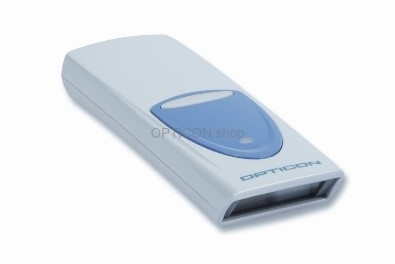
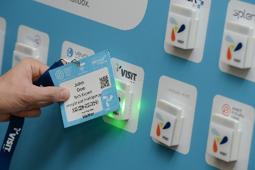

# Visit by GES: Guide to Setting up On-Site

## Introduction

 

Some of the most critical features of Visit are used onsite. It’s important to ensure you get these set up correctly to provide an efficient service to the visitors and exhibitors, and to collect accurate data.

This guide will help you get up and running with the following systems:

## EventBox

This is a tailor-made system which performs many of the functions at the event entrance: registration of new visitors (including self-service tools), badge printing (including collection using a code), access control, and tools to manage exhibitor’s Visit Connect accounts for lead capture.

    
  
EventBox can also be used for access control to seminars.

It runs on a PC, either using a USB memory stick, or installed on the hard drive.

## Visit Go

This software provides access control features, and Covid health checks by scanning approved government covid codes. It runs on a smartphone or tablet using the built-in camera.

## Data Pens

  
Where it is not convenient to place an EventBox by a seminar entrance, access control for seminars can also be done with a datapen. This is a small battery-powered handheld device that scans and records standard barcodes. You will need to issue these datapens to link to each seminar, and ‘download’ them to store the data in Visit.

 

## Touchpoints

A touchpoint is a small device that you mount in a visible place for Visitors too see. It is linked to a particular activity, exhibitor, product, or seminar room. 
  

  
When the visitor taps the touchpoint with a suitable badge, the touchpoint records the badge details and time. For exhibitors, this generates lead information (including details of the product the visitor expressed an interest in). For organisers, it tracks entry to seminars or particular activities or interests.

Touchpoints only work if the event uses badges containing an NFC chip.

